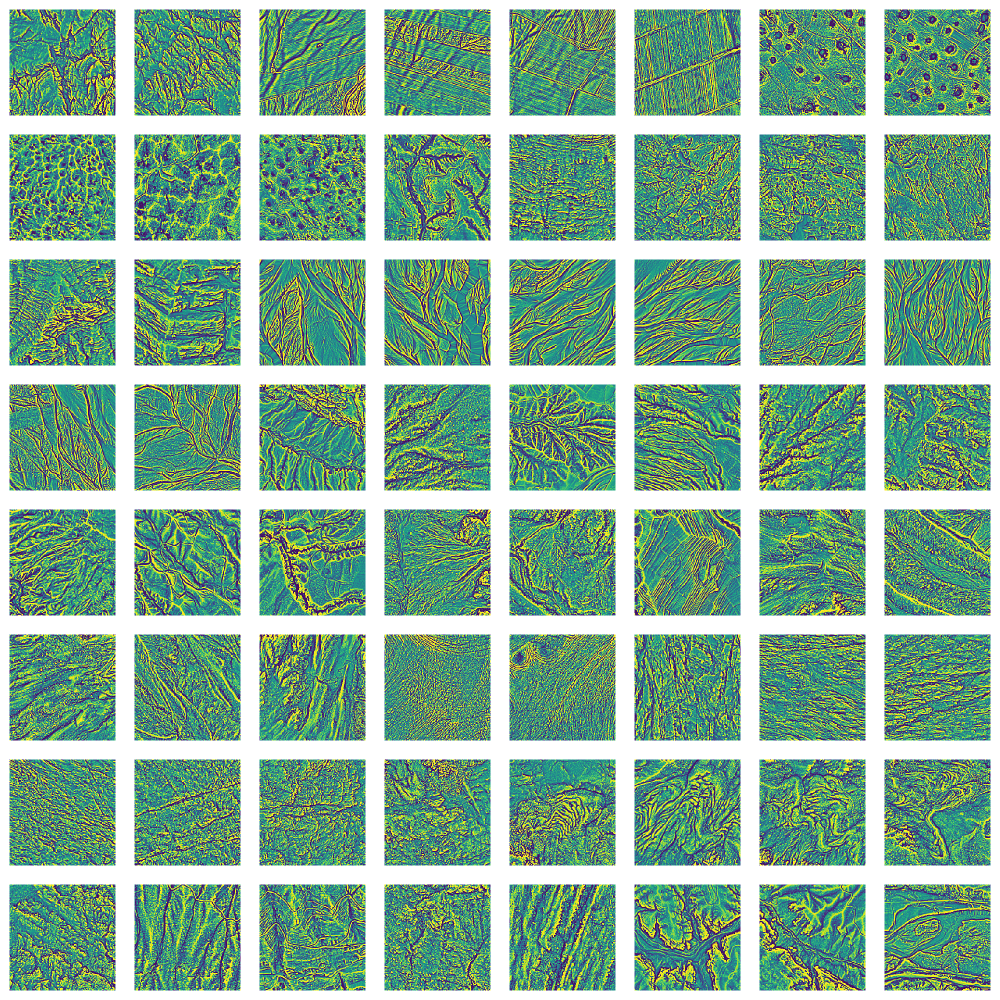

# Atlas-of-surface-textures
A working space for the design and implementation of an atlas for surface textures. Initially based on solid earth surface data, but extensible to planetary surfaces and others type of surfaces. The starting point is a collection of DEM tiles, but it could be extended to other formats such as lidar point clouds.

**In regard to "collection0" tiles:**

This is a first experimental version of DEM tiles at 2 m resolutions with an extent of 256x256 pixels. 
The tiles cover mainly alpine morphologies (with some exception) in northern Italy, covering the Trentino Province and the Friuli Venezia Giulia Region.
A basic informative table concerning each DEM tile is in table "atlas_textures_csv".

**_Residual surfaces of the DEM tiles of "Collection0"_**

The data are derived from public repositories of the provincial and regional institutions reported below.

**For Trentino:**
- Lidar survey 2006 Trentino
- http://www.territorio.provincia.tn.it/portal/server.pt/community/lidar/847/lidar/23954
- License: Creative Commons - Attribuzione 2.5 Italia

**For Friuli Venezia Giulia**
- Rilievo LIDAR RAFVG 2017-2020
- https://irdat.regione.fvg.it/consultatore-dati-ambientali-territoriali/detail/irdat/dataset/11826
- License: ITALIA OPEN DATA LICENSE V2.0 (IODL 2.0)

  
